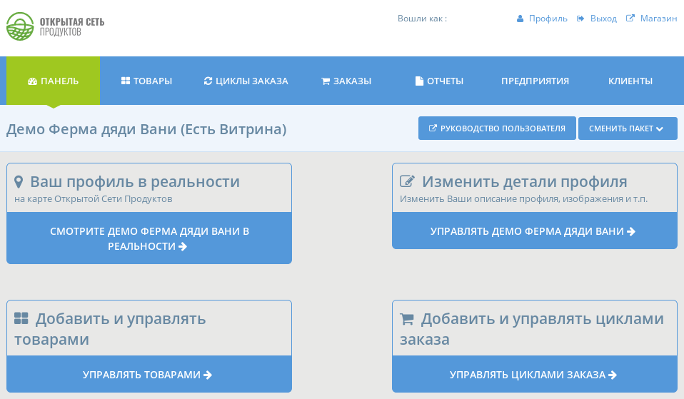

# Панель

Панель \(инструментов\) - это место, где вы можете редактировать и управлять функциями и настройками вашего предприятия на платформе Открытая Сеть Продуктов. Если вы решили зарегистрировать свое предприятие как [магазин](../your-quick-start-on-ofn-given-who-you-are.md#shop) или [центр](../your-quick-start-on-ofn-given-who-you-are.md#hub) тогда в Панели вы можете реадактировать ваши товары и циклы заказов.

Чтобы получить доступ к своей панели из домашней страницы, сначала войдите в систему, затем нажмите значок профиля в верхнем правом углу и  в выпадающем меню выберите 'Управление'.

The options you will see on your dashboard will depend on which enterprise type you choose on [registration](register-and-create-your-profile.md). The screenshots below show the dashboard view for different types of users.

## Producers











## Hubs











