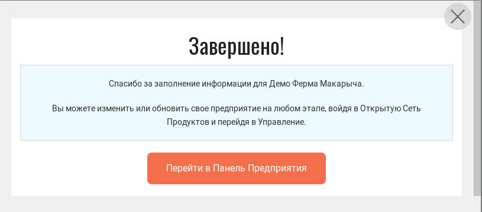
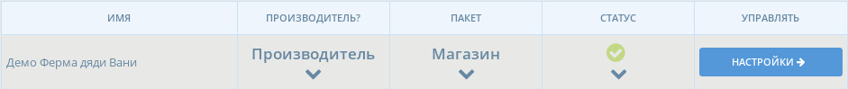
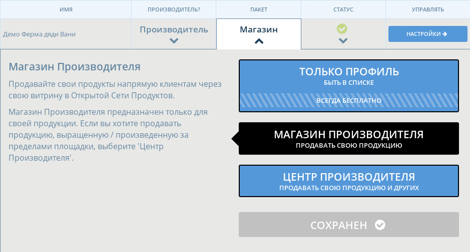
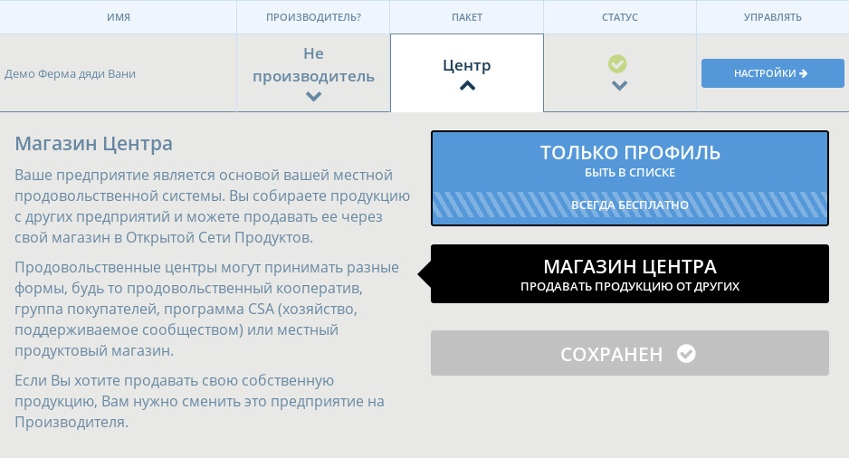
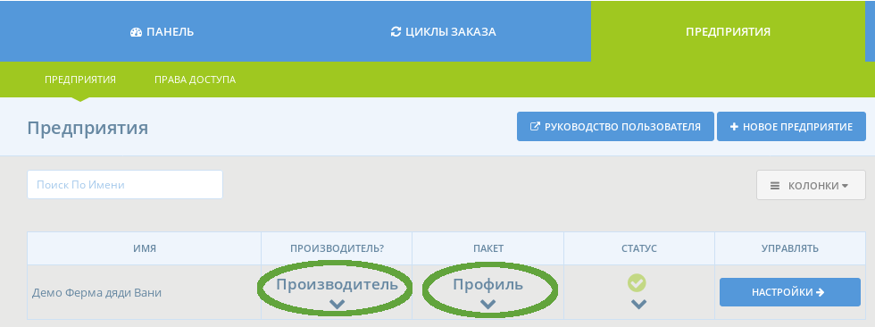

# Пакет / типы профиля

После завершения [регистрации вашего предприятия](../register-and-create-your-profile.md), будет возможность напрямую перейти на [страницу настроек предприятия](enterprise-settings.md).

Отсюда вам нужно будет выбрать ОСП профиль, который [лучше всего подходит вашей модели бизнеса](../../your-quick-start-on-ofn-given-who-you-are.md). **Без этого шага ваш профиль предприятия не будет создан и следовательно ваше предприятие останется невидимым на нашей карте.**

Открытая Сеть Продуктов предлагает три типа профиля предприятий, которые будут различаться в зависимости от того, являетесь ли вы производителем или нет и хотите ли вы открыть онлайн-магазин для продажи в Открытой Сети Продуктов. Типы профилей немного различаются в зависимости от того, являетесь ли вы производителем или нет, поэтому мы опишем их ниже в двух основных разделах: профили для производителей и профили для дистрибьюторов \(или 'Центров' в мире Открытой Сети Продуктов\).

## Для Производителей

Существует три типа профиля для производителей:



С этой опцией ваше предприятие не только будет видно на карте ОСП и для клиентов, которые ищут нашу платформу, но вы сможете управлять каталогом товаров. Ваши товары могут распространяться и продаваться через другие предприятия, входящие в сеть ОСП.

Как 'Профиль Производителя' вы не сможете управлять своим интернет-магазином. Для дополнительной информации о руководстве быстрой настройки это типа профиля, [нажмите тут](../../quick-start-guides/).


Если вы хотите продавать свои продукты на существующей платформе онлайн-продаж и использовать ОСП просто для повышения своей наглядности, тогда пакет 'Профиль Производителя' для вас!

Вы можете поместить ссылку на ваш интернет-магазин в описании вашего предприятия.




## Вы хотели бы продавать на ОСП только свои товары

Эта опция позволяет вам запускать интернет-магазины, которые продают в розницу товары только из вашего каталога. Обратите внимание, что 'Магазины Производителей' могут осуществлять продажи через собственную витрину и/или выступать в качестве поставщика для других магазинов \(центров\).

Для дополнительной информации о руководстве быстрой настройки это типа профиля, нажмите [тут](../../quick-start-guides/).



## Вы хотели бы продавать свою продукцию, а также продукцию других производителей/поставщиков

Эта опция позволяет вам управлять магазином, в котором продаются товары, сделанные вами и другими местными производителями. Вы можете продавать товары от любого Производителя, кто вам дал для этого соответствующие [разрешения](create-or-connect-with-your-supplying-producers.md).

Для дополнительной информации о руководстве быстрой настройки это типа профиля, нажмите [тут](../../quick-start-guides/).



## Для Не Производителей \(Центры\)

Для не производителей \(дистрибьюторов/хабов\) доступны два типа профилей:



С помощью этой опции ваше предприятие будет видно на карте ОСП и для клиентов, ищущих на нашей платформе.

Для дополнительной информации о руководстве быстрой настройки это типа профиля, нажмите [тут](../../quick-start-guides/).


Если вы хотите продавать товары, изготовленные группой производителей на существующей платформе онлайн-продаж и использовать ОСП просто для повышения своей наглядности, тогда пакет 'Профиль Не Производителя' для вас!

Вы можете поместить ссылку на ваш интернет-магазин в описании вашего предприятия.




### Вы хотели бы создать интернет-магазин

Эта опция позволяет вам управлять магазином, в котором продаются товары других производителей. Вы можете продавать товары от любого Производителя, кто вам дал для этого соответствующие [разрешения](create-or-connect-with-your-supplying-producers.md).

Для дополнительной информации о руководстве быстрой настройки это типа профиля, нажмите, [нажмите тут](../../quick-start-guides/multi-producers-shop-hub-quick-setup-guide.md).



## Изменение типа профиля

В будущем вы можете в любое время изменить ваш тип профиля \(пакет\). Сначала войдите в свой ОСП профиль администратора:

затем пройдите в [меню Настроек Предприятия](enterprise-settings.md). В таблице, выберите необходимые опции в выпадающем меню. \(Чтобы сделать это, вы должны быть '[Владельцем](enterprise-settings.md#users)' предприятия\)

## Следующий шаг

После того как вы выбрали соответствующий тип профиля для вашей модели бизнеса, вы можете заполнить любую недостающую информацию и дополнительно уточнить настройки в меню [Настройки Предприятия](enterprise-settings.md).

