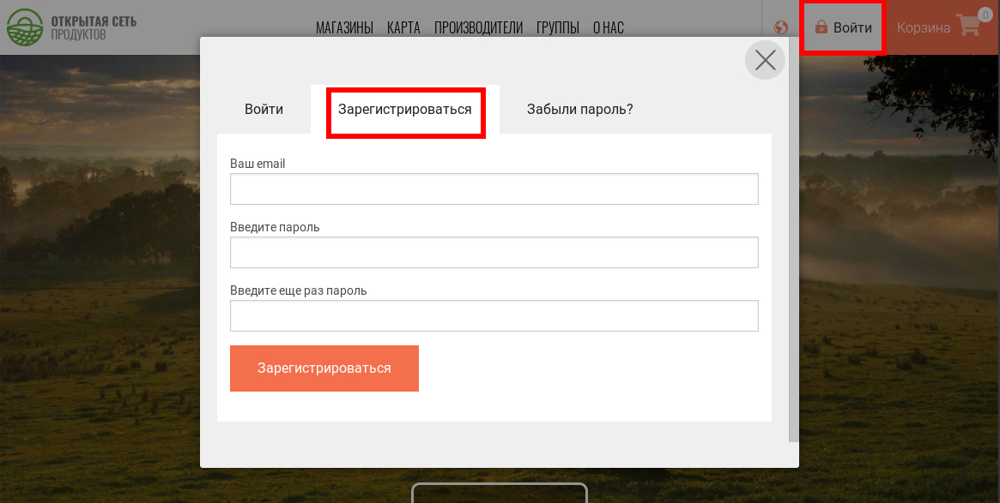
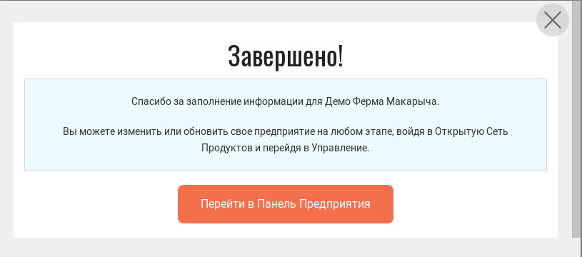
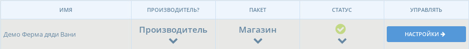

# Регистрация и Создание Профиля Предприятия

## Создание профиля пользователя

* С домашней страницы, нажмите на "Войти" в правом верхнем углу, затем "Зарегистрироваться" 

* Введите свой email и выберите пароль.
* В следующие пару минут вам придет email с сылкой подтверждения. Нажмите на неё и вы будете перенаправлены на страницу входа.  
* Войдите


Если вы не получили от нас электронное письмо с подтверждением, возможно оно попало в папку СПАМ/SPAM/JUNK вашего почтового ящика.


## Создайте профиль вашего первого "предприятия"

* Открыв сайт, нажмите на верхний серый баннер "Заинтересованы в продажах через Открытую Сеть Продуктов? **Регистрируйтесь тут**" 

* Нажмтие 'Начнём!'

* Заполните имя вашего предприятия и контакты.


Ваш адрес будет использован для добавления вашей компании на нашу карту предприятий ОСП и следовательно, для повышения вашей видимости.


* Выберите между 'Производитель' \(Вы сами делаете/печете/выращиваете продукты\) или 'Не Производитель' \(Вы распространяете и продаете еду, сделанную другими\).

* Click the ‘create profile’ button.  You'll receive an email confirming that the profile is created. You can stop here and fill in the missing information later, or continue and follow the steps to complete your profile now. 
* Fill in your enterprise description, add images, website/social media links, business details, etc.
* When you have finished, you will be redirected to the [Enterprise Profile Menu](enterprise-profile/).

**Your first "enterprise" is now created and you have started to fill in your profile, but it's not finished!**

**The next step is to** [**choose the OFN package**](enterprise-profile/package-types.md) **\(= profile type\) which best represents your** [**business model**](../your-quick-start-on-ofn-given-who-you-are.md)**.**

**After doing so, your enterprise will added to the OFN map!**

**A short clip of registering your enterprise on OFN:**

## Access your Enterprise Administration Dashboard

Once you have created an Enterprise, you can manage your profile using the Dashboard. To access your Enterprise Dashboard log in to the Open Food Network and click on "Profile &gt; Administration" in the top right corner. See [Dashboard ](dashboard.md)for more information.

