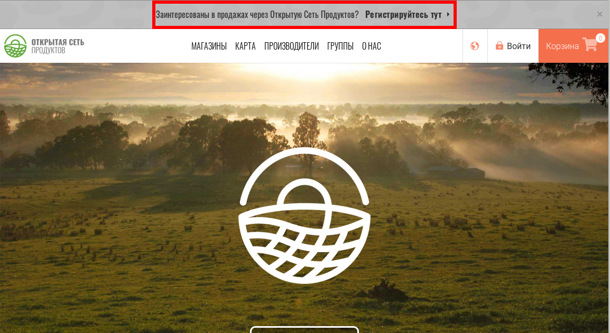

# Регистрация и Создание Профиля Предприятия

## Создание профиля пользователя

* С домашней страницы, нажмите на "Войти" в правом верхнем углу, затем "Зарегистрироваться" 

* Введите свой email и выберите пароль.
* В следующие пару минут вам придет email с сылкой подтверждения. Нажмите на неё и вы будете перенаправлены на страницу входа.  
* Войдите


Если вы не получили от нас электронное письмо с подтверждением, возможно оно попало в папку СПАМ/SPAM/JUNK вашего почтового ящика.


## Создайте профиль вашего первого "предприятия"

* Открыв сайт, нажмите на верхний серый баннер "Заинтересованы в продажах через Открытую Сеть Продуктов? **Регистрируйтесь тут**" 

* Нажмтие 'Начнём!'

* Заполните имя вашего предприятия и контакты.


Ваш адрес будет использован для добавления вашей компании на нашу карту предприятий ОСП и следовательно, для повышения вашей видимости.


* Выберите между 'Производитель' \(Вы сами делаете/печете/выращиваете продукты\) и 'Не Производитель' \(Вы распространяете и продаете еду, сделанную другими\).

* Нажмите кнопку 'Создать профиль'.  Вы получите электронное письмо, подтверждающее, что профиль создан. Вы можете здесь остановиться и заполнить недостающую информацию позже, или продолжить и следовать инструкциям, чтобы заполнить свой профиль сейчас.
* Заполните описание своего предприятия, добавьте изображения, ссылки на веб-сайты/социальные сети, юридическую информацию и т.д.
* Когда закончите, вы будете перенаправлены на [Меню Профиля Предприятия](enterprise-profile/).

Ваше первое 'предприятие' создано и вы начали заполнять свой профиль, но он еще не завершен!

**Следующий шаг -** [**выбрать пакет ОСП**](enterprise-profile/package-types.md) **\(= тип профиля\), который лучше всего подходит вашей** [**модели бизнеса**](../your-quick-start-on-ofn-given-who-you-are.md)**.**

**После этого ваше предприятие будет добавлено на карту ОСП!**

## Доступ к Панели Управления Предприятием

Создав Предприятие, вы можете управлять своим профилем с помощью панели инструментов. Чтобы получить доступ к корпоративной информационной панели, войдите в Открытую Сеть Продуктов и нажмите 'Профиль &gt; Управление' в правом верхнем углу. Для информации смотрите [Панель](dashboard.md).

