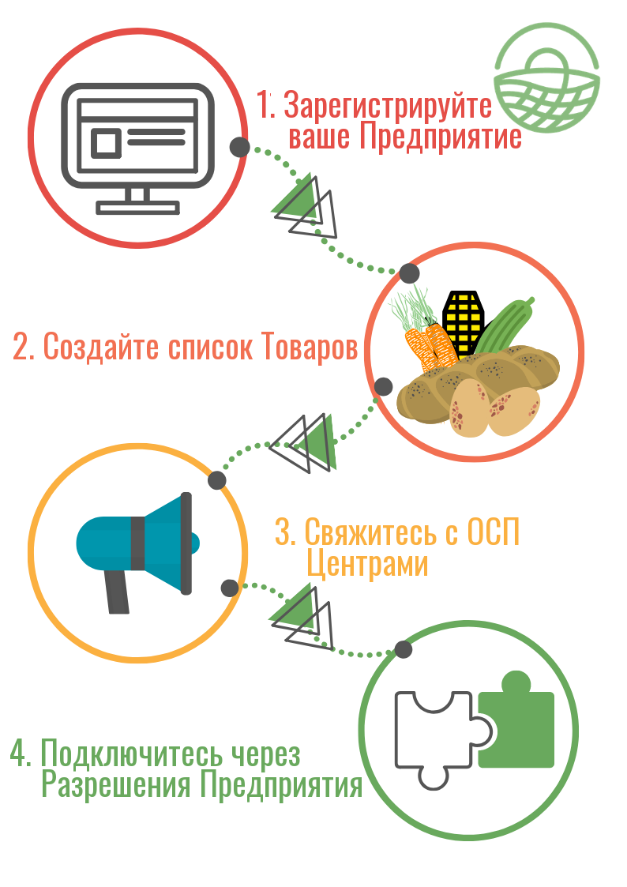

# Профиль

Начать работу с OFN легко, просто следуйте инструкциям ниже:

1. [Зарегистрируйте ваше предприятие](../basic-features/register-and-create-your-profile.md).

   Выберите [типы пакетов](../basic-features/enterprise-profile/package-types.md) 'Производитель', а затем 'Профиль' и завершите [настройки вашего предприятия](../basic-features/enterprise-profile/enterprise-settings.md), указав юридическую информацию.

2. Перечислите ваши [товары](../basic-features/products-1/products.md).
3. Свяжитесь с центрами ОСП, через которые вы хотели бы продавать свои продукты. Это так же просто, как поговорить с менеджером центра при сборе покупок или отправьте им электронное письмо.
4. Подключитесь через ОСП к центру, где вы хотите продавать свои товары, настроив соответствующие [разрешения предприятия](../basic-features/enterprise-profile/enterprise-to-enterprise-permissions-e2es.md).

Поздравляем! Вы сделали свою работу!

Центр, управляющий вашими продажами, должен периодически отправлять вам заказы на основе согласованных вами временных интервалов. Уведомления о заказах могут быть автоматизированы Центром, чтобы получать их по электронной почте.


Если вы хотите использовать ОСП, чтобы только быть видимым в Интернете, то нет необходимости выполнять шаги 2-4 выше.



Вы можете сделать свой профиль производителя доступным для поиска по товарной категории, даже если вы фактически не хотите продавать товары, выполнив следующие [шаги](../basic-features/enterprise-profile/making-a-producer-profile-searchable-by-product-category.md).


## More advanced features you might need

* Your products: 
  * Specify special [credentials](../basic-features/products-1/product-properties.md) they may have have \(eg. organic, plastic free...\)
  * If you have a product which can be sold in different forms \(eg. potatoes sold in 500g, 1kg and 2 kg quantities\) then you can simplify your listings by adding [variants](../basic-features/products-1/product-variants.md).
  * If you sell irregular items like meat or vegetables \(eg. a whole chicken, a large pumpkin\) which are priced by weight then you can learn [how to do this here.](../basic-features/products-1/pricing-irregular-items-kg.md)
  * You can [import](../basic-features/products-1/product-and-inventory-import.md#1-import-new-products) your all your product listings at once if they are in an Excel spread sheet.

